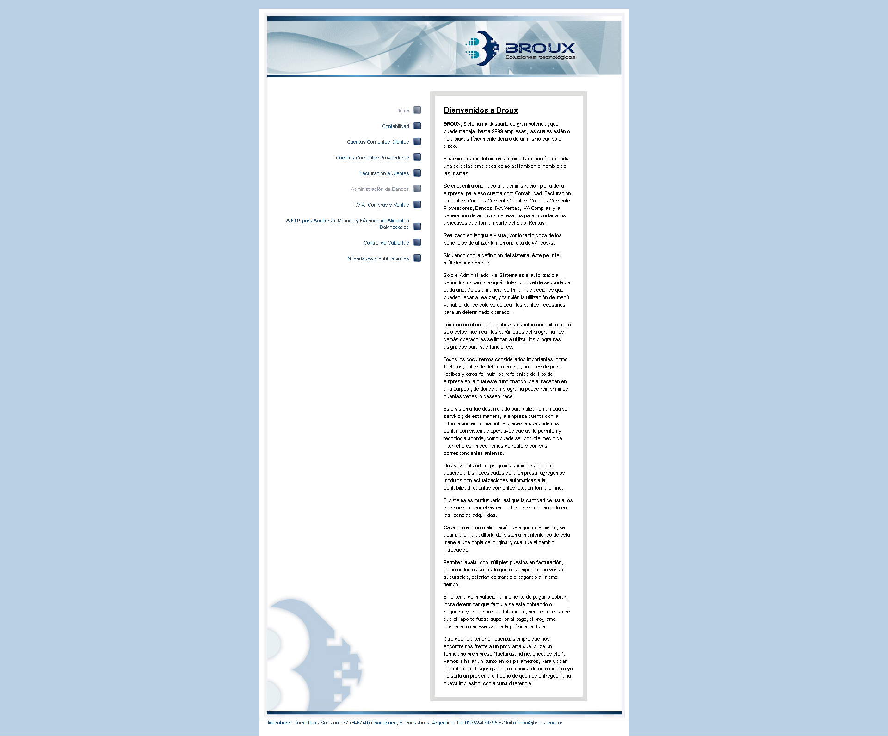

# Broux, Soluciones Tecnológicas

Grimoldi, Joaquín

## Resumen

+ Actualizado de página, tipografía y logotipos.
+ Desarrollo web para Broux. Es una página informativa acerca de la empresa, buscando acercar al cliente con nuevos métodos de contacto e informarle acerca de sus propósitos.
+ Cuenta ademas con un sistema de inicio de sesion y administrador de archivos para usar como alojamiento.
+ Tecnologías: HTML5, CSS3, FlexBox, JavaScript, PHP, JSON
+ Otras Tecnologías: Adobe XD, Adobe Illustrator

## Summary

+ Updated website, typography and logos.
+ Web development for Broux. It is an informative page about the company, seeking to bring the customer with new methods of contact and inform them about their purposes.
+ It also has a login system and file manager to use as hosting.
+ Technologies: HTML5, CSS3, FlexBox, JavaScript, PHP, JSON
+ Other Technologies: Adobe XD, Adobe Illustrator

### WebSite

+ before / antes

+ after / después

---

## Web Features / Características de la Web

## General

+ main-color: **#**

+ font-family: **Poppins, sans-serif, FontAwesome**

+ font-color-white: **#**

+ font-color-black: **#**

+ font-color-mute: **#**

+ font-weight-h1: **700**, font-weight-button: **700**

+ font-weight-header: **500**

+ font-weight-p: **400**, font-weight-label: **400**, font-weight-input: **400**

+ font-weight-footer: **300**, font-weight-placeholder: **300**

### Mobile / Celular

+ font-size-h1: **38px**

+ font-size-h2: **35px**

+ font-size-h3: **25px**

+ font-size-logo: **16px**

+ font-size-a: **16px**

+ font-size-p: **16px**

+ font-size-input: **16px**

+ font-size-button: **16px**

+ font-size-social: **25px**

+ font-size-footer: **14px**

### Desktop / Escritorio

+ font-size-h1: **55px**

+ font-size-h2: **50px**

+ font-size-h3: **30px**

+ font-size-logo: **18px**

+ font-size-a: **18px**

+ font-size-p: **18px**

+ font-size-input: **18px**

+ font-size-button: **18px**

+ font-size-social: **25px**

+ font-size-footer: **16px**
