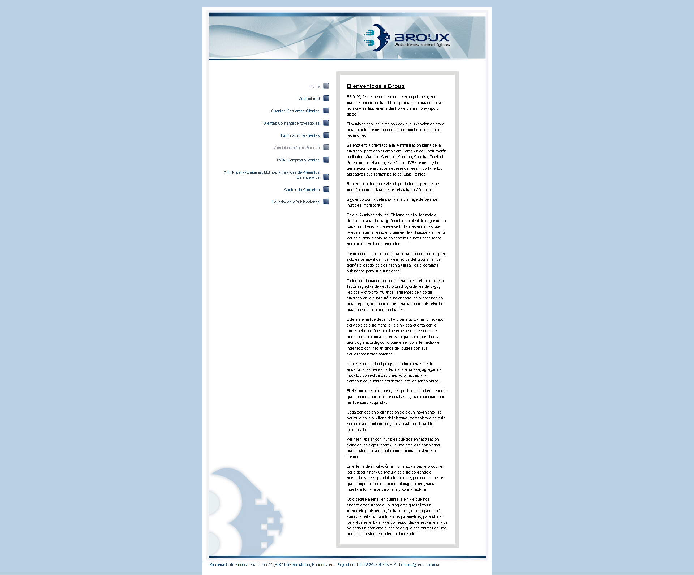
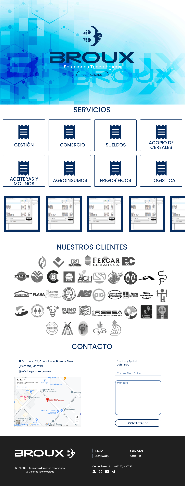

# Broux, Soluciones Tecnológicas

Grimoldi, Joaquín

## Resumen

+ Actualizado de página, tipografía y logotipos.
+ Desarrollo web para Broux. Es una página informativa acerca de la empresa, buscando acercar al cliente con nuevos métodos de contacto e informarle acerca de sus propósitos.
+ Cuenta ademas con un sistema de inicio de sesion y administrador de archivos para usar como alojamiento.
+ Tecnologías: HTML5, CSS3, FlexBox, JavaScript, PHP, JSON
+ Otras Tecnologías: Adobe XD, Adobe Illustrator

## Summary

+ Updated website, typography and logos.
+ Web development for Broux. It is an informative page about the company, seeking to bring the customer with new methods of contact and inform them about their purposes.
+ It also has a login system and file manager to use as hosting.
+ Technologies: HTML5, CSS3, FlexBox, JavaScript, PHP, JSON
+ Other Technologies: Adobe XD, Adobe Illustrator

### WebSite

+ before / antes

+ after / después

---

## Web Features / Características de la Web

## General

+ --main-color          : **#072D60**

+ --secondary-color     : **#6889B5**

+ --font-color-main     : **#072D60**

+ --font-color-secondary: **#FFFFFF**

+ --border-color        : **#6889B5**

+ --font-weight-regular : **400**

+ --font-weight-medium  : **500**

+ --font-weight-bold    : **700**

+ --background-footer   : **#202020**

### Mobile / Celular

+ --width-logo          : **13.384rem**

+ --height-logo         : **13.8rem**

+ --width-isologo       : **58.3rem**

+ --heigth-isologo      : **8rem**

+ --font-size-h1        : **4.2rem**

+ --font-size-h2        : **4rem**

+ --font-size-h3        : **2.2rem**

+ --font-size-banner    : **1.8rem**

+  --font-size-text     : **1.6rem**

+ --font-size-textsnd   : **1.4rem**

### Desktop / Escritorio

+ --width-logo          : **13.384rem**

+ --height-logo         : **13.8rem**

+ --width-isologo       : **58.3rem**

+ --heigth-isologo      : **8rem**

+ --font-size-h1        : **5.2rem**

+ --font-size-h2        : **5rem**

+ --font-size-h3        : **3.2rem**

+ --font-size-banner    : **2.5rem**

+ --font-size-text      : **1.8rem**

+ --font-size-textsnd   : **1.6rem**